# Install & Launch

Download CloudDesigner here : [http://www.obeo.fr/download/occiware/](url "http://www.obeo.fr/download/occiware/").
If you installed a previous version, you can update it using the Update-site.

Unzip the bundle, then launch the eclipse application.

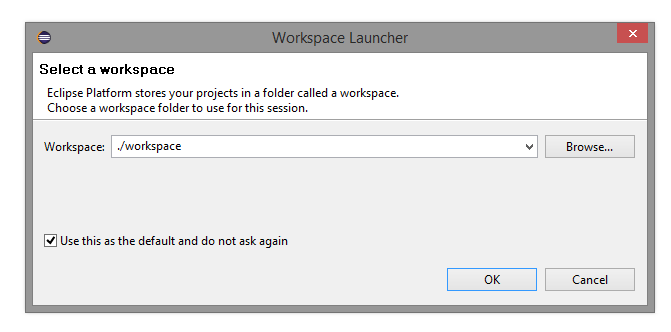 

You can type « ./workspace » to locate the workspace under the CloudDesigner installation directory.

# Create a new OCCI Extension

This tool allow to create new OCCI extensions, which can be used to define configurations and to generate tooling. To create a new extension, follow the steps below :

*   Right-click on the project explorer, click « New »:

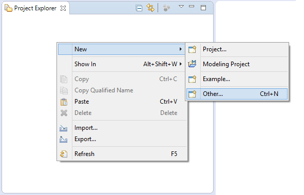 

*   Select « Other » then « OCCI Extension Project ».

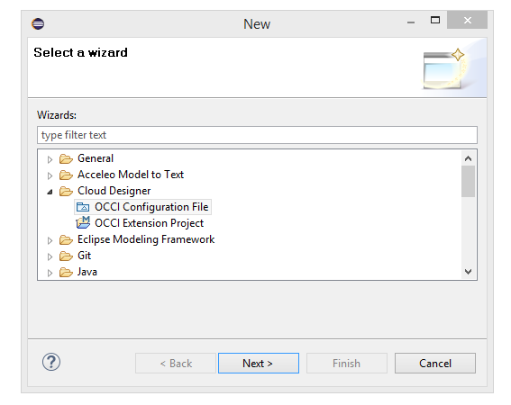 

*   Fill in the project name (it is advised to put a namespace first then the extension name, like in « _my.company.extensionname_  »)

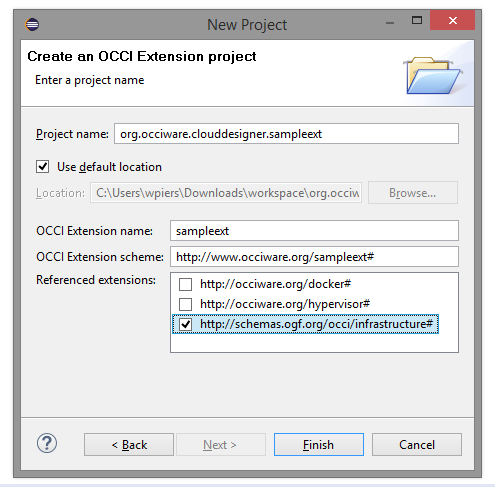 

*   Select the extensions you wish to extend (you will be able to change that later) and click « Finish »

# The OCCI Extension Designer

*   Once the diagram is opened you can create elements. For instance to attach a kind to its parent you can use the parent edge tool or set the parent in the property view, in the Semantic tab.

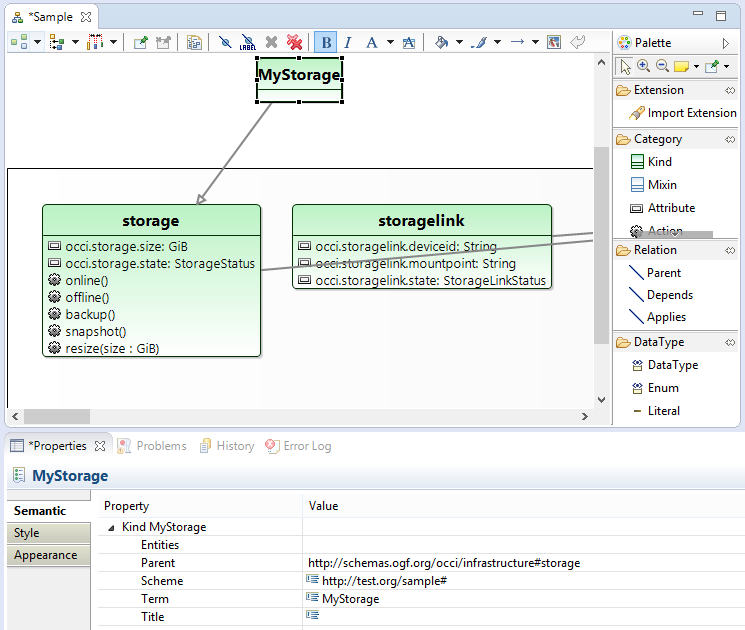 

*   There is also a textual syntax for OCCI, which can be useful for quick editing like search & replace. To view an OCCI model as text, simply double click on it (.occic & .occie are recognized).

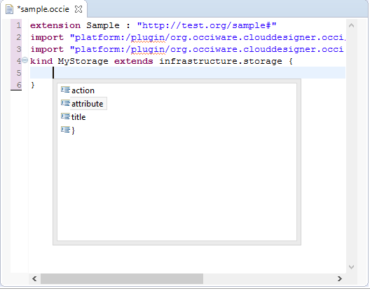 

*   When the extension is ready to use, you can check its correctness by validating it (right-click in the background of the diagram, validate). Then you can register the .occie file in order to use the extension in other models like configurations.

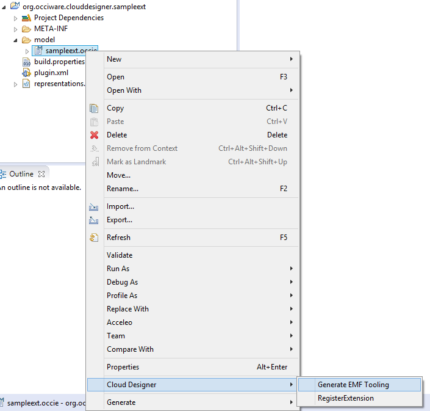 

# The OCCI Configuration Designer

First, create a modeling project to host the configuration. If you already have a place for it you can skip this step.

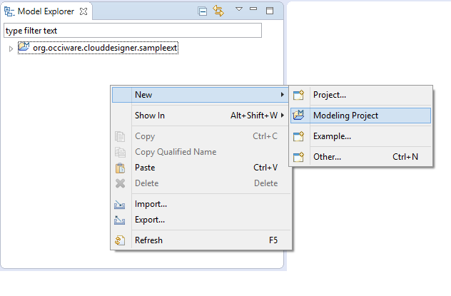 

Then, right-click in project explorer « New > Other » to create this time a configuration. 

 

If the new extension has been registered using the « Register Extension » action, you can select it. 

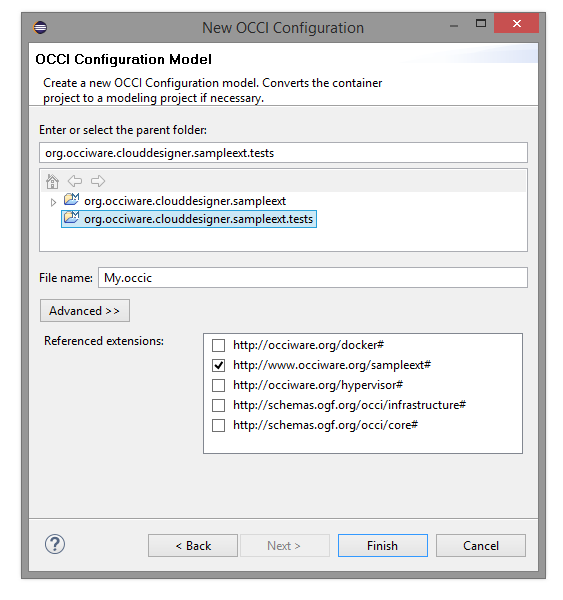 

Finally, you can create the configuration.

# Using the generators

The .occie extension model can be used as source of several generators: Textile, Alloy, Erocci. To generate one of those artefacts right-click on the .occie file and choose a generator from the CloudDesigner menu:

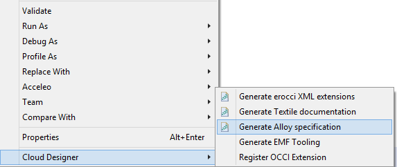

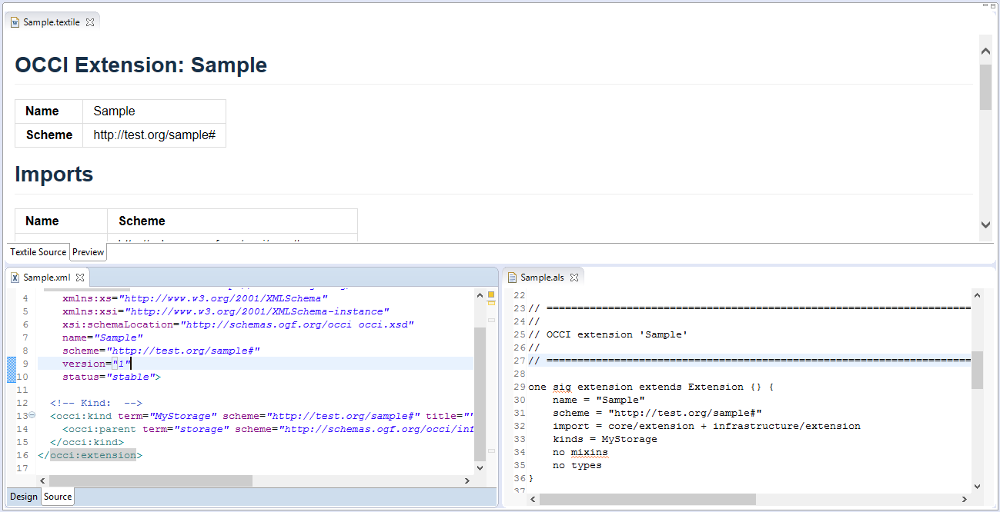

A CURL script can be generated from the same menu with .occic (Configurations) files.
