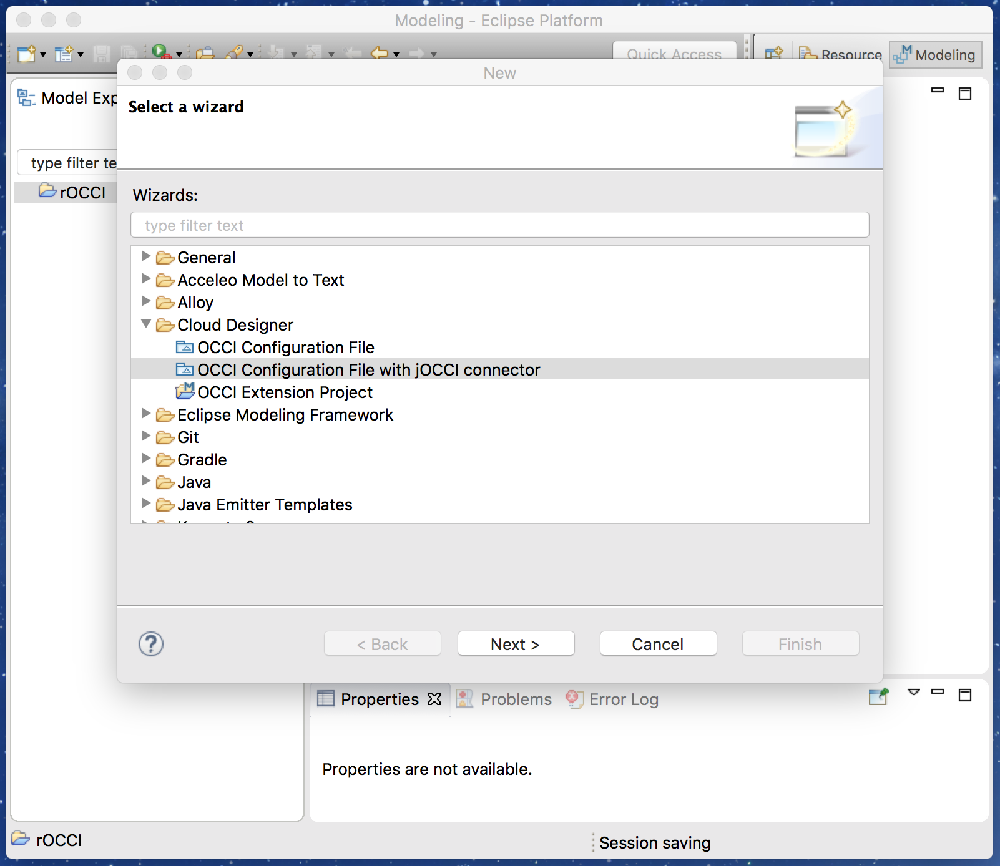
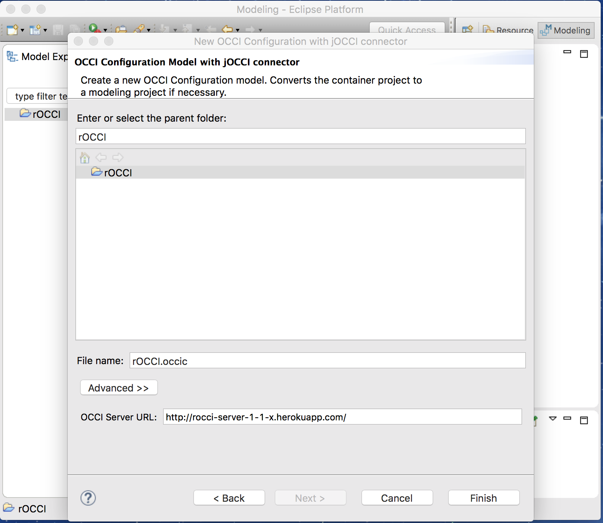
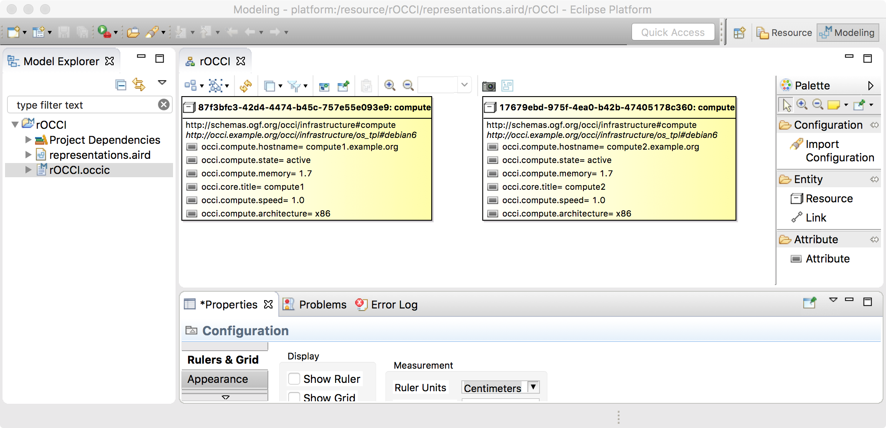
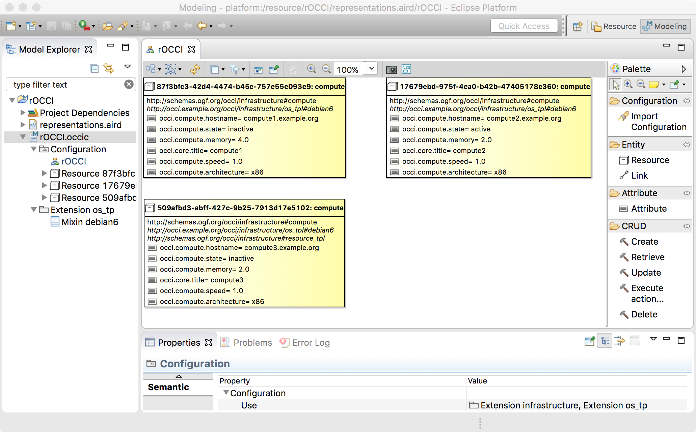
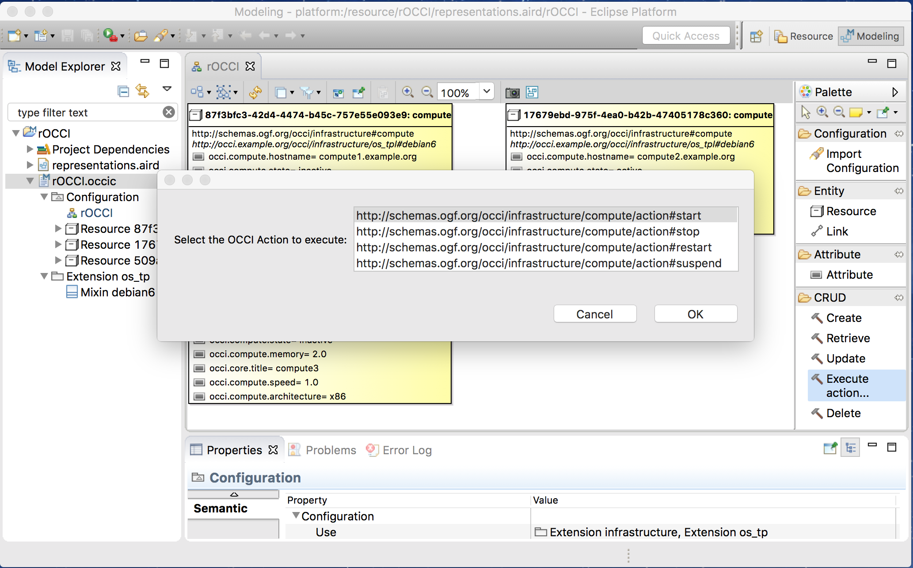

# Introduction

This connector allows one to interact with OCCI servers:
* Import OCCI entities from an OCCI server
* Create/Retrieve/Update/Delete OCCI entities hosted by an OCCI server
* Execute OCCI actions on OCCI entities

Current supported OCCI servers are [erocci](http://erocci.ow2.org) and [rOCCI](https://github.com/EGI-FCTF/rOCCI).

This connector is based on [jOCCI](https://github.com/EGI-FCTF/jOCCI-api), an open source Java-based OCCI client library.

# Usage

* Select "New" / "Cloud Designer" / "OCCI Configuration File with jOCCI connector" in order to create a new OCCI Configuration File with jOCCI connector:

* Enter the OCCI configuration file name and the URL of an OCCI server:

* Then a new OCCI configuration file is created and contains all OCCI entities hosted by the OCCI server:

* Select a CRUD operation (Create, Retrieve, Update, Execute action, and Delete) in the palette then select the OCCI entity on which to apply the CRUD operation:

* Select "Execute action..." to execute an OCCI action on an OCCI entity:

# TODO

* Complete retrieving OCCI entities from an OCCI server (changed kind/mixins/attributes)
* Deal with parameters of OCCI actions to execute
* Deal with OCCI server authentication
