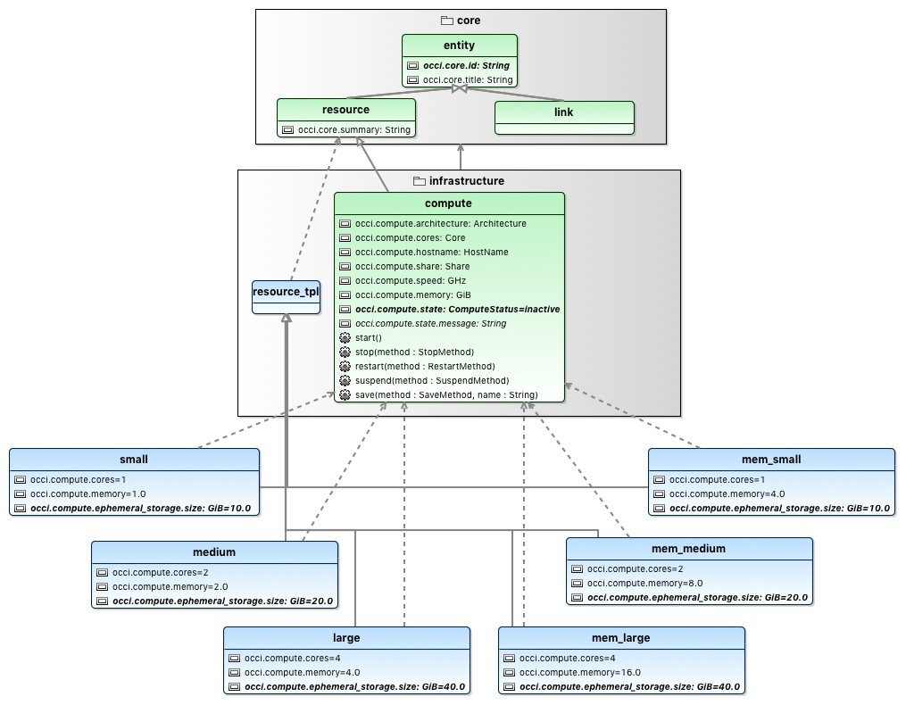

# OCCI Compute Resource Templates Profile

This project implements the [OCCI Compute Resource Templates Profile 1.1 specification](https://redmine.ogf.org/attachments/218/resource_profile_crtp-1.1_v2.pdf).

Following figure shows the model of this OCCI extension:

The full Textile documentation of this OCCI extension is available [here](documentation/textile/crtp.textile).
