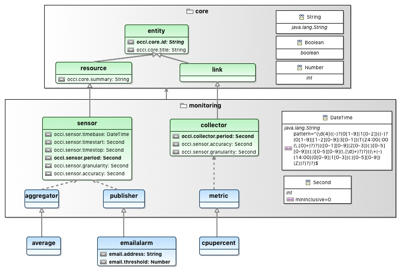
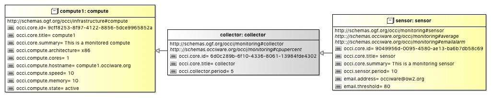

# OCCIware Monitoring Extension

This project extends the OCCI Monitoring extension with OCCIware specific mixins.

The following figure shows the content of this OCCI extension:

The full Textile documentation of this OCCI extension is available [here](documentation/textile/occiware_monitoring.textile).

The following figure shows an [OCCI configuration example](examples/MonitoredCompute.occic) using this OCCI extension: 

