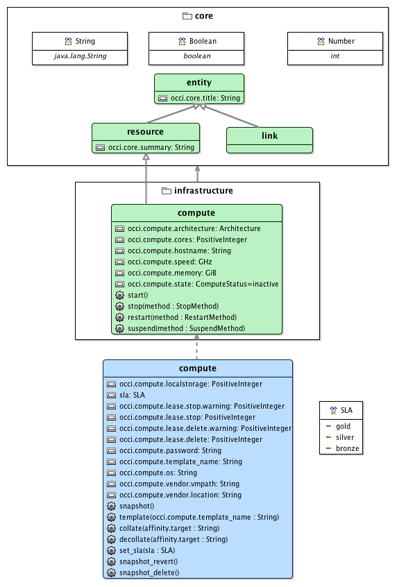
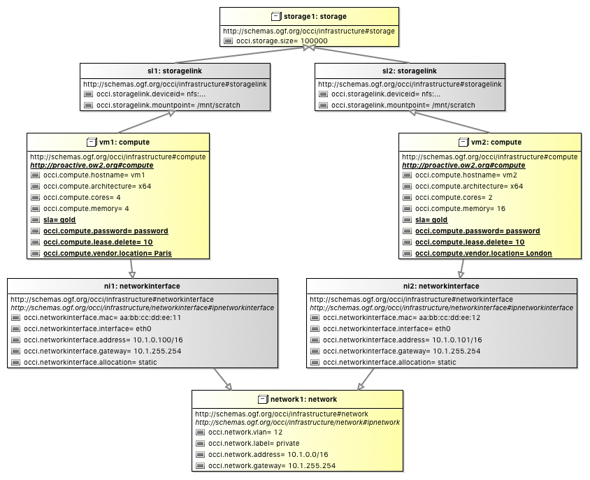

# ProActive Cloud Automation OCCI Extension

This project contains the OCCI extension for ProActive Cloud Automation.

The following figure shows the content of this OCCI example, i.e., both mixin `compute` and enumeration `SLA`:

The full Textile documentation of this OCCI extension is available [here](documentation/textile/pca.textile).

The following figure shows an [OCCI configuration example](examples/infrastructure.occic) using this OCCI extension: 

Let pay attention to the OCCI attributes in bold, i.e., `sla`, `occi.compute.password`, `occi.compute.lease.delete`, and `occi.compute.vendor.location`, of the two compute `vm1` and `vm2` instances.
