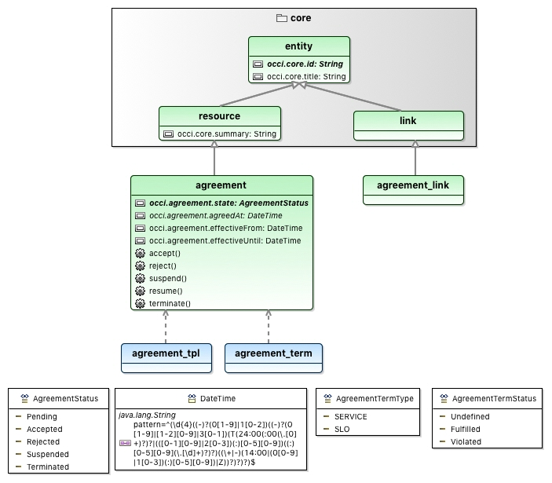
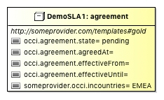
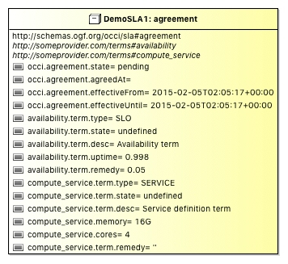
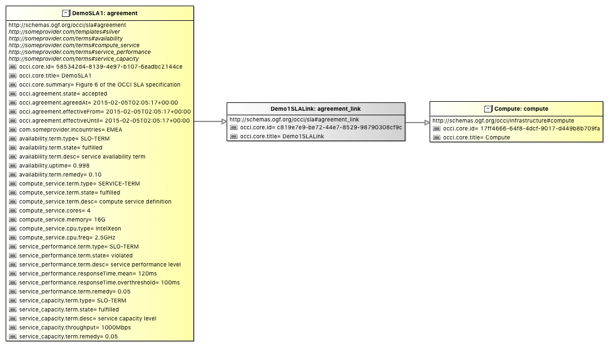
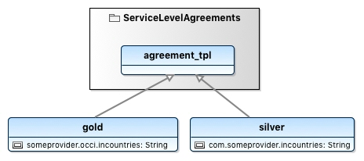
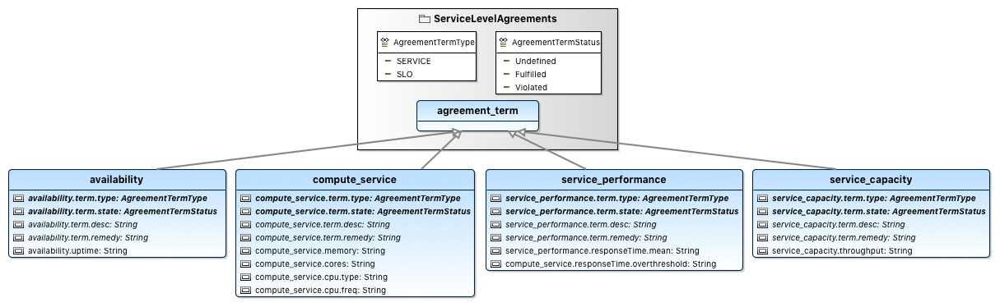

# OCCI Service Level Agreements Extension

This project implements the [OCCI Service Level Agreements 1.2 specification](https://redmine.ogf.org/attachments/224/slas.pdf).

The following figure shows the content of this OCCI extension:

The full Textile documentation of this OCCI extension is available [here](documentation/textile/ServiceLevelAgreements.textile).

## Examples

Following figures are the modeling of examples given in the [OCCI SLA 1.2 specification](https://redmine.ogf.org/attachments/224/slas.pdf).

Textile documentation of this previous OCCI extension is available [here](documentation/textile/templates.textile).

Textile documentation of this previous OCCI extension is available [here](documentation/textile/terms.textile).
